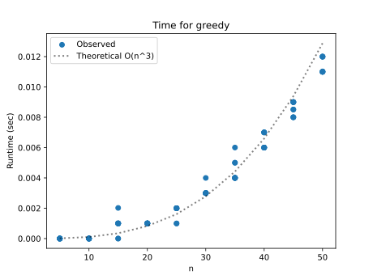
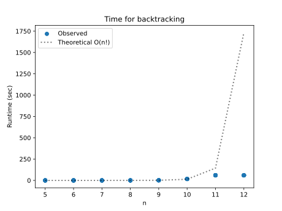
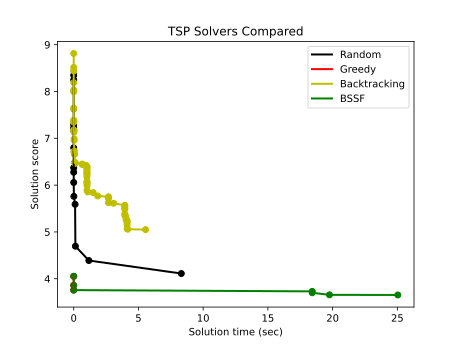

# Project Report - Backtracking

## Baseline

### Design Experience

met with:
SCUBY Discord (Caleb, Bill, Tyler)
Greedy proved to be a relatively easy design. Since we only need to visit the minimum length non-visited edge then recurse an explore function until we visit all edges. If the final node connects to the start, we wrap it up in a SolutionsStats object and add it to the list.

### Theoretical Analysis - Greedy

#### Time 

O(n^3)
So the time complexity is caused by three loops. Initially we need to iterate through each starting node.
    for curr_node in range(len(edges)):
        if timer.time_out():
            break
        greedy_explore(curr_node, [curr_node], {curr_node})

Then inside of greedy_explore we have O(n^2) because we recurse n times and check n nodes each time. Which leads us to O(n^3)

#### Space

O(n)
We only need to store the list[SolutionStats] so our O is linear O(n)

### Empirical Data - Greedy

| Size | Reduction | Time (sec) |
| ---- | --------- | ---------- |
| 5    | 0         | 0.0        |
| 10   | 0         | 0.0        |
| 15   | 0         | 0.001      |
| 20   | 0         | 0.001      |
| 25   | 0         | 0.002      |
| 30   | 0         | 0.003      |
| 35   | 0         | 0.004      |
| 40   | 0         | 0.006      |
| 45   | 0         | 0.009      |
| 50   | 0         | 0.011      |

### Comparison of Theoretical and Empirical Results - Greedy

- Theoretical order of growth: O(n^3)
- Empirical order of growth (if different from theoretical): not different

## Core

### Design Experience

Met with:
SCUBY discord (Bill, Caleb, Tyler)
For this tier, I literally just removed the minimum edge check and placed the recursion within the loop. From there we just need to pop the tour and visited lists after recursing.

### Theoretical Analysis - Backtracking

#### Time 

O(n!)
Instead of just recursing once every n times, we recurse n-1 times every n times. In other words, we recurse n times, then n-1 times, then n-2 times, which is the definition of n!

        for index, edge in enumerate(edges[current]):
            if index in visited or math.isinf(edge):
                continue
            else:
                tour.append(index)
                visited.add(index)
                backtracking_explore(index, tour, visited)  <----- right here is the killer because its now inside the for loop
                tour.pop()
                visited.remove(index)

#### Space

O(n)
we don't actually add any more space complexity because we only use a single list at a time.

### Empirical Data - Backtracking

| Size | Reduction | Time (sec) |
| ---- | --------- | ---------- |
| 5    | 0         | 0.001      |
| 6    | 0         | 0.003      |
| 7    | 0         | 0.021      |
| 8    | 0         | 0.168      |
| 9    | 0         | 1.606      |
| 10   | 0         | 16.922     |
| 11   | 0         | 60.001     |
| 12   | 0         | 60.0       |

### Comparison of Theoretical and Empirical Results - Backtracking

- Theoretical order of growth: O(n!)
- Empirical order of growth (if different from theoretical): Same as theoretical

NOTE: The size 12 run timed out!!!

### Greedy v Backtracking

Backtracking is guaranteed to give us the most optimal paths, though in many scenarios it may not be worth it as O(n!) is about as bad as it gets compared to greedy's O(n^3).

### Water Bottle Scenario 

#### Scenario 1

**Algorithm: Backtracking** 

Because he needs the very best algorithm, backtracking is necessary as neither greedy nor bssf are guaranteed to return it, but backtracking is.

#### Scenario 2

**Algorithm: greedy** 

He needs a solution and he needs it fast so greedy is the best choice here.

#### Scenario 3

**Algorithm: BSSF** 

Because there's sparce edges, pruning will be helped along. It will give a better answer than greedy and won't time out like backtracking would on twenty nodes

## Stretch 1

### Design Experience

Met with:
SCUBY discord (Bill, Caleb, Tyler)
With this tier, we're able to reuse alot of code, though do need to make some small changes. This is primarily in how we calculate score and pruning when that calculation is guaranteed to be worse when exploring the branch.

### Demonstrate BSSF Backtracking Works Better than No-BSSF Backtracking 

Because BFFS avoids timeout by pruning, it is able to explore more and find faster solutions than Non-BFFS

### BSSF Backtracking v Backtracking Complexity Differences

Both are O(n!) in the worst case, though because BFFS prunes, it is able to avoid worst case whereas no BFFS will always hit worst case.

### Time v Solution Cost

NOTE: Greedy isn't absent, after running the code multiple times, I found that because I initiate my BFFS with the greedy algorithm before exploring further, it overlaps with the BFFS algorithm.

We can see in the plot that Backtracking with BFFS finds better solutions quicker than all others (aside from greedy who finds mediocre solutions the fastest). Random sits in a middle ground and backtracking appears to do the worst solution-wise but that is because it times out before it can find competitive solutions.

## Stretch 2

### Design Experience

*Fill me in*

### Cut Tree

*Fill me in*

### Plots 

*Fill me in*

## Project Review

Compared results with the people from my design experiences. We got the same results with the same methods. Bill and I were the only ones to complete stretch tiers but everyone completed Core and Baseline. This group hops in discord calls before and after the project to facilitate this exchange.
